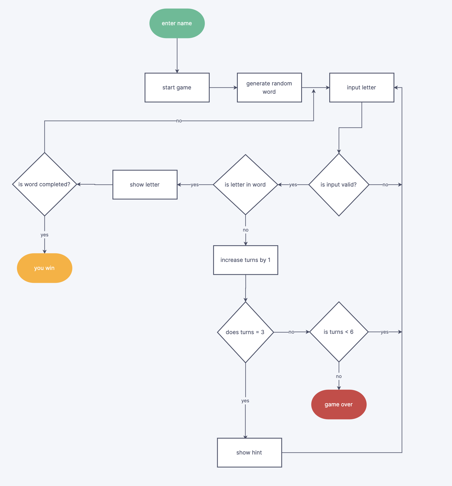
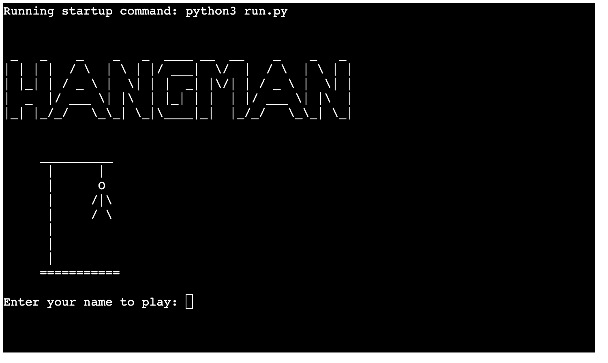
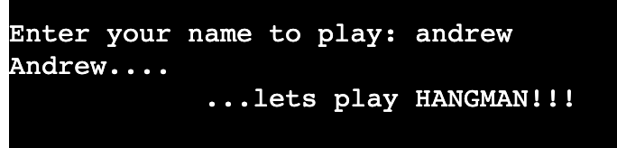
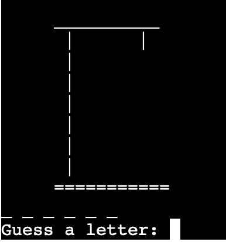
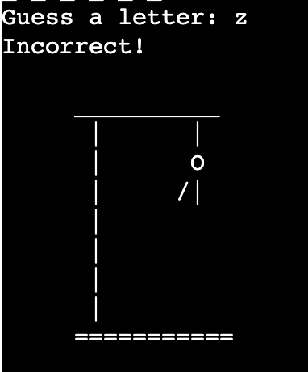
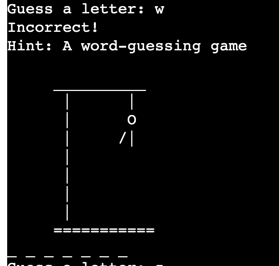
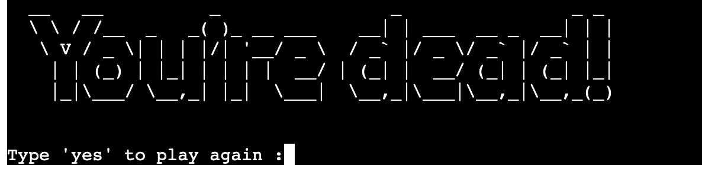
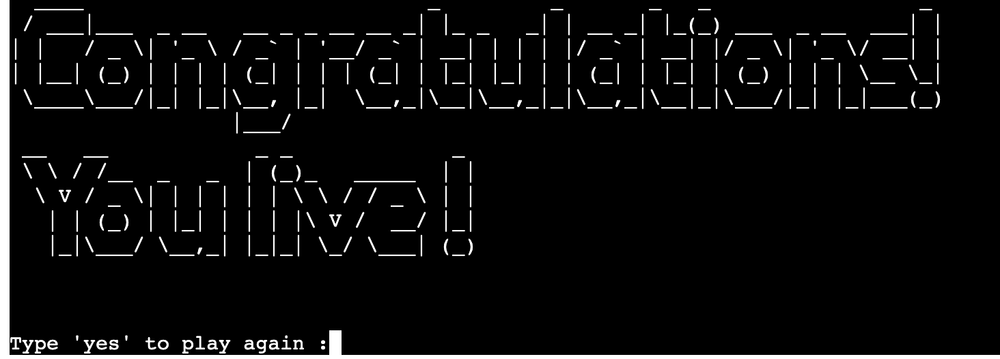

# Hangman

Many jobs nowadays, particularly in the world of software development, demand intense focus. Neuroscience has shown that when people have to focus
for long periods, cognitive resources are used up and performance declines. 

Luckily, there are ways to replenish! 
Hangman is a classic game that provides the perfect balance of light directed focus and fun to get those valuable recourses up again. 

This version of hangman is s Python terminal game that runs on Code Institute's mock terminal on Heroku.

# [Link to live site](https://hangman-agame-app.herokuapp.com)
## How to play

The player enters their name, and the game begins. A word is generated randomly from a list, and as the player
guesses the correct letters, the word is revealed. Only five incorrect attempts are allowed. When the player
has two lives remaining, a hint is provided. At the end of the game, the player has the option to restart
and begin again with a new word.

## Planning

### Goals

* To create a fun and challenging game that is simple and engaging.
* The game should be challenging enough to incite the player to continue playing.

### Logic Flow Chart

Before I began to write the code, I made a flow chart.

This helped answer questions like:

* How to determine the order of the processes
* How to deal with invalid inputs
* How to deal with incorrect inputs

## Features

### Title and name entry

* This is the first thing displayed. It gives an inviting presence to the game, with a familiar image of the hangman game.

* The player is asked to enter their name, and a personal welcome is displayed.

### Main game display
* The player is presented with the hidden word in whice each correct letter is revealed.

* The hangman's gallows image is gradually presented with each incorrect answer.

* A helpful hint is given when there are two turns remaining.

### Game over display

* This displayed the graphic of the end adding a dramatic finale to the game.

## Testing

* The code was passed through Code Institute's PEP8 Linter https://pep8ci.herokuapp.com/, and PEP8 was installed using the "pip" command.  
  Any issues with indentation and line spacing were resolved.

* I used replit.com to run the code and test manually. This involved testing validation of all inputs.
  This showed up the bugs with the "greeting()" function and the "restart()" function.
  
## Bugs fixed

* Initially I had the word list outside the main game function, which didn’t work with the restart function. 
* I added the "hint" feature to make the game more enjoyable.
* Validation to the "greeting()" function was added. Originally, the game would proceed even if the player had not entered anything when asked for their name.
  This was fixed by adding an "if/else" statement which only validated letters as a possible name.  
* Validation in "restart_game()" function had to be added as the program broke when invalid input was provided to restart the game.
  The initial function restarted the game if the player typed "yes" and did nothing if "no" was typed. If invalid input was typed the program broke.
  This was fixed by adding an if/else statement which checked for valid input. It also displayed a thank you message if "no" was typed.
* The original version had a list of ten words. This was expanded to fifty to avoid repetitiveness.
* At the end of the game the word was never revealed. This left a sense of incompleteness and dissatisfaction at the end, especially if you lost.
  So, the code was added to show the word.  

## Future Additions

* In the future I would like to add a function for the player to choose a difficulty setting at the beginning of the game. There would be three word lists depending on the desired 
  difficulty. This would add an extra dimension to the playing of the game and provide a sense of progress as one moves on to more difficult levels.

## Deployment

The project was deployed using Code Institutes mock terminal for Heroku.

Deployment steps:
* Create a new app in Heroku.
* Select "New" and "Create new app".
* Name the new app and click "Create new app".
* In Settings, select "BuildPack" and select Python and Node.js. (Python must be at the top of the list).
* Whilst still in "Settings", click "Reveal Config Vars" and input the following: KEY: PORT, VALUE: 8000. Nothing else is needed here as this project does not have any sensitive files.
* Click on "Deploy" and select your deploy method and repository.
* Click "Connect" on selected repository.
* Either choose "Enable Automatic Deploys" or "Deploy Branch" in the manual deploy section.
* Heroku will now deploy the site.

